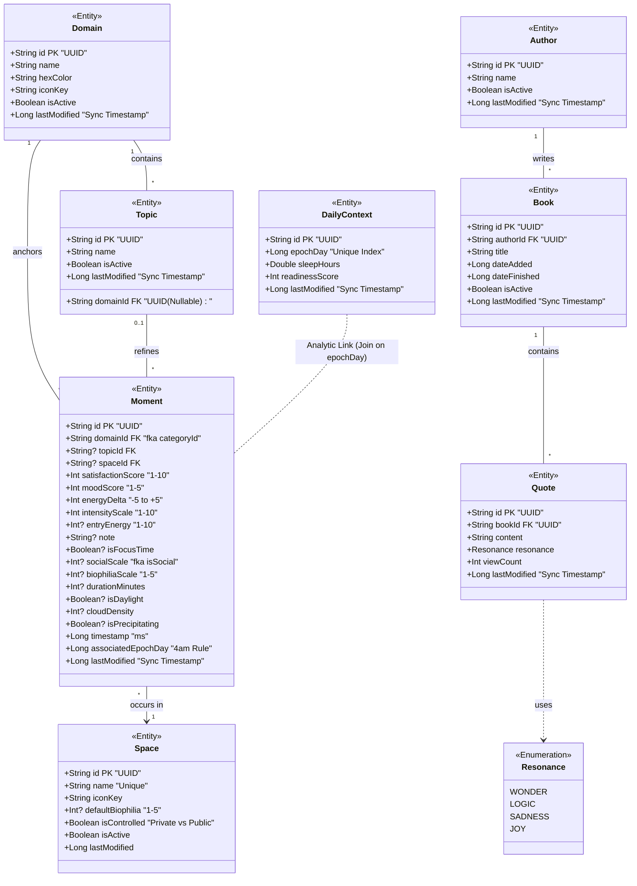

### Mocha Me

---

<details>
<summary><b> Kotlin Multiplatform Structure</b></summary>

<br>
This is a Kotlin Multiplatform project targeting Android, iOS, Desktop (JVM).

- [/composeApp](./composeApp/src) is for code that will be shared across your Compose Multiplatform applications.
  It contains several subfolders:
  - [commonMain](./composeApp/src/commonMain/kotlin) is for code that’s common for all targets.
  - Other folders are for Kotlin code that will be compiled for only the platform indicated in the folder name.
    For example, if you want to use Apple’s CoreCrypto for the iOS part of your Kotlin app,
    the [iosMain](./composeApp/src/iosMain/kotlin) folder would be the right place for such calls.
    Similarly, if you want to edit the Desktop (JVM) specific part, the [jvmMain](./composeApp/src/jvmMain/kotlin)
    folder is the appropriate location.

- [/iosApp](./iosApp/iosApp) contains iOS applications. Even if you’re sharing your UI with Compose Multiplatform,
  you need this entry point for your iOS app. This is also where you should add SwiftUI code for your project.

### Build and Run Android Application

To build and run the development version of the Android app, use the run configuration from the run widget
in your IDE’s toolbar or build it directly from the terminal:

- on macOS/Linux
  ```shell
  ./gradlew :composeApp:assembleDebug
  ```
- on Windows
  ```shell
  .\gradlew.bat :composeApp:assembleDebug
  ```

### Build and Run Desktop (JVM) Application

To build and run the development version of the desktop app, use the run configuration from the run widget
in your IDE’s toolbar or run it directly from the terminal:

- on macOS/Linux
  ```shell
  ./gradlew :composeApp:run
  ```
- on Windows
  ```shell
  .\gradlew.bat :composeApp:run
  ```

### Build and Run iOS Application

To build and run the development version of the iOS app, use the run configuration from the run widget
in your IDE’s toolbar or open the [/iosApp](./iosApp) directory in Xcode and run it from there.

</details>

---

<details>
<summary><b> Data Model </b></summary>



</details>

---

<details>
<summary><b> Testing Architecture & Commands </b></summary>

<br>
The architecture is unified through a custom Gradle verification system that provides synchronized logging and automated cache invalidation across platforms.

### Testing Architecture

| Tier                   | Target              | Technology                     | Description                                                                                   |
| :--------------------- | :------------------ | :----------------------------- | :-------------------------------------------------------------------------------------------- |
| **Common**             | `commonTest`        | `kotlin.test`, Turbine, MockK  | Platform-agnostic logic, ViewModels, and Flow/Coroutine verification.                         |
| **JVM**                | `jvmTest`           | JUnit 5                        | High-speed desktop-side execution for shared logic and Desktop-specific components.           |
| **Host (Robolectric)** | `androidHostTest`   | Robolectric, JUnit 4 (Vintage) | Simulated Android environment running on the JVM. Includes SQLite/Room database verification. |
| **Instrumented**       | `androidDeviceTest` | AndroidJUnitRunner             | Hardware-accurate tests running on physical devices or emulators for UI and integration.      |

---

### Verification Commands

The project includes specialized Gradle tasks to manage the build lifecycle and testing suites effectively. 'All' commands automatically bypass the task cache to ensure a fresh "rerun" of the test logic.
Application is not implementing ios testing, but the setup allows integration in the future.

The commands below print all tests results and their corresponding platform to the terminal, providing
a cross-platform test run/analysis with a single command.

#### Local Suite (Fastest)

Use these for rapid iteration during active development.

- **`./gradlew verifyLocal`**: Runs all JVM and Android Host (Robolectric) tests.
- **`./gradlew verifyLocalAll`**: Performs a `clean` followed by all local unit tests to ensure no stale artifacts remain.

#### Full Suite (Comprehensive)

For pre-merge verification and final system checks.

- **`./gradlew verify`**: JVM, androidHost, and connected Android device tests.
- **`./gradlew verifyAll`**: The "Nuclear Option." Wipes the entire build directory and executes every test suite from scratch.

---

### Abstract Base Test Pattern

**Shared Logic (commonTest)**:

- Defines an abstract class containing all test scenarios and common logic using kotlin.test.
- E.g. declares an abstract fun createDatabase() to decouple logic from implementation.

**Platform Implementation (jvmTest, androidHostTest, etc.**):

- Each target extends the base class and provides their own concrete implementations handling their own dependencies. The commands above then run the platform instances.

</details>

---
