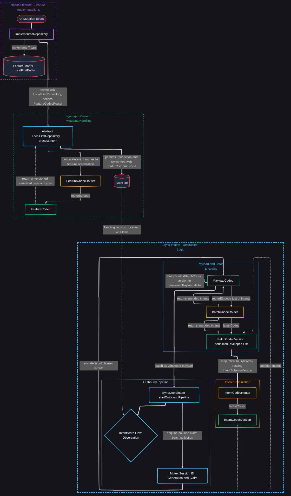
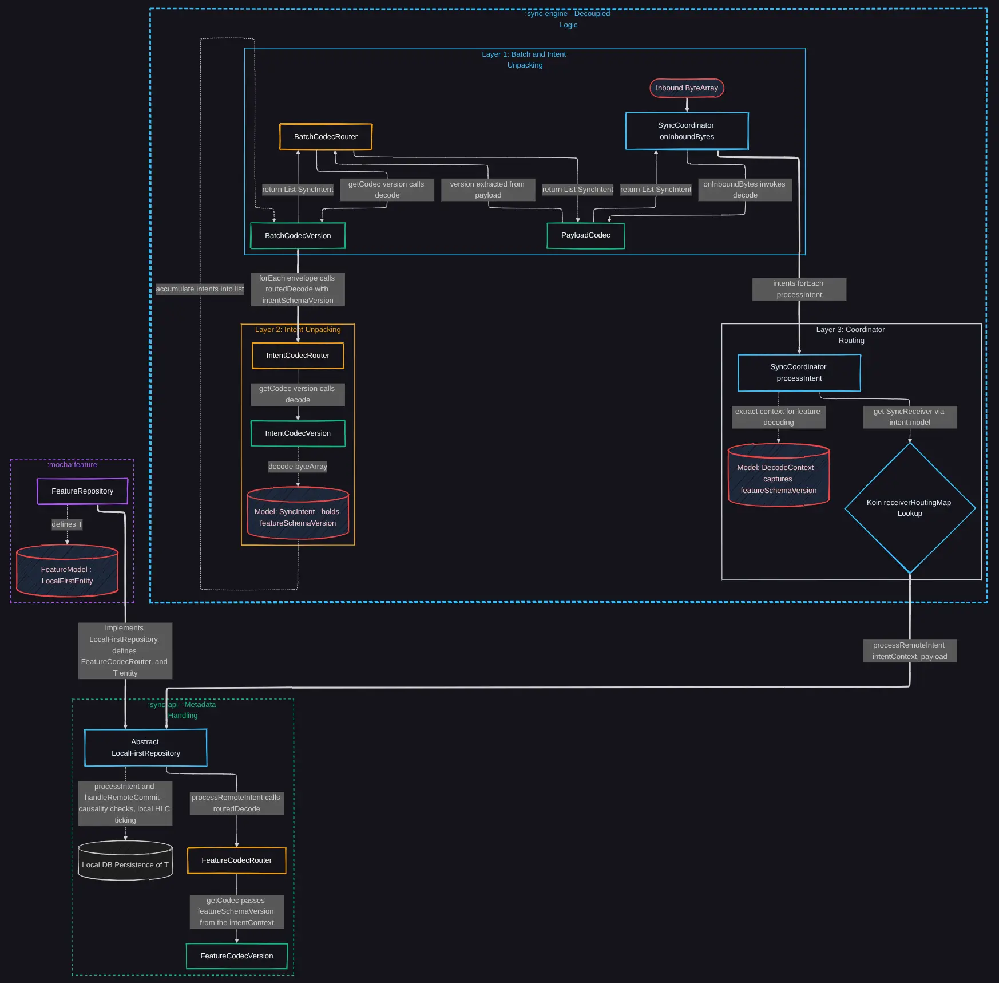
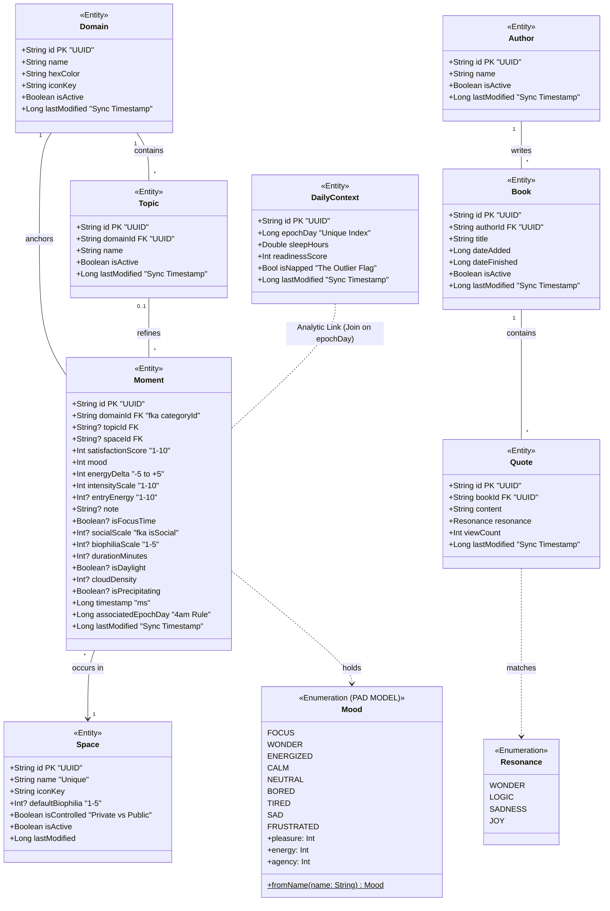

# MochaMe-KMP

This project is an exploration into Kotlin Multiplatform. The goal is to build a decoupled, privacy-centric, local-first synchronization system capable of being deployed across platforms using minimal platform-specific boilerplate, exposing a lightweight module of contracts for any implementing features, with the application incorporating swappable edge AI inference. The centerpiece of this architecture is platform testability - utilizing Gradle and Koin.

---

<details>
<summary><b> Local First Architecture </b></summary>

<br>

Needs Updating 


</details>

---

<details>
<summary><b> Multiplatform Architecture </b></summary>

#### Approach to Development:

Needs Updating but general idea:

<br>

```text
┌────────────────────────────────────────┐
│              app:assembly              │
└───────────────────┬────────────────────┘
                    │
┌───────────────────▼────────────────────┐
│                 mocha:                 │
│  (mocha-feature, mocha-schema, etc.)   │
└───────────────────┬────────────────────┘
                    │
┌───────────────────▼────────────────────┐
│              sync-engine               │
└───────────────────┬────────────────────┘
                    │
┌───────────────────▼────────────────────┐
│                  core:                 │
│  (sync-contract, platform, logger)     │
└────────────────────────────────────────┘
```

<br>


<br>

</details>

---

<details>
<summary><b> Approach to Gradle Build Design </b></summary>

#### Gradle Build-Logic Configs

###### Core builds to plug in, and what they provide.

##### 1. `mocha.provider` (Lightweight Infrastructure)

**Purpose:** Configures pure structural dependencies and targets for modules that act as APIs or expect/actual providers for simple requirements. Avoids all test runner configuration.

- **Targets Declared:** `jvm()`, `linuxX64()`, `android()`.
- **Source Sets Declared:** None explicitly.
- **Test Runners:** None.
- **Koin Compiler:** Applied.
- **Room Scope:** None.

##### 2. `mocha.logic` (Pure Logic)

**Purpose:** Configures the standard execution environment for pure Kotlin modules that do not define persistence schemas. Essentially just tools.

- **Targets Declared:** `jvm()`, `linuxX64()`, `android()`.
- **Source Sets Declared:** `androidHostTest`, `androidDeviceTest`, `jvmTest`
- **Test Runners:** Standard test runners (`androidHostTest`, `jvmTest`, `linuxX64Test`, iOS) injected - _unit tests_.
- **Koin Compiler:** Applied.
- **Room Scope:** None.

##### 3. `mocha.feature` (Heavy Components)

**Purpose:** Designed exclusively for features that require isolated micro-schemas for testing their integration logic across platforms.

- **Targets Declared:** `jvm()`, `linuxX64()`, `android()`.
- **Source Sets Declared:** `commonMain`: Injects `implementation(libs.room.runtime)` to allow `@Dao` and `@Entity` compilation.
- **Test Runners:** Standard test runners (`androidHostTest`, `jvmTest`, `linuxX64Test`) injected.
- **Koin Compiler:** Applied.
- **Room Scope:** Runtime: Provided to `commonMain`.
- **KSP (Compiler):** Applied strictly to test configurations purely for Room, not Koin (e.g., `kspAndroidHostTest`, `kspJvmTest`). Keeps main targets free of generation overhead - no `@Database` in main, purely in test.

##### 4. `mocha.assembler` (Aggregator)

**Purpose:** Configures the final assembly points where domain DAOs are aggregated into production code.

- **Targets Declared:** `jvm()`, `linuxX64()`, `android()`.
- **Source Sets Declared:** `commonMain`: Injects `implementation(libs.room.runtime)`.
- **Test Runners:** Fully configured.
- **Koin Compiler:** Applied.
- **Room Scope:** Runtime: Provided to `commonMain`.
- **KSP (Compiler):** Applied to standard main configurations (e.g., `kspAndroid`, `kspJvm`). Expect `@Database` in main.

<br>


</details>

---

<details>
<summary><b> Serialization Architecture </b></summary>

<br>

## Outbound



## Inbound



</details>

---

<details>
<summary><b> AI Approach for Development </b></summary>

#### AI Usage Aim:

Different contexts assigned roles attempting to achieve domain specialization and cross verification.
This has sort of changed to a standard verifier and architect context between Claude and Gemini with some Antigravity CLI usage.
If the component is more complex, I will create specific roles.

| Lead    | Domain       | Focus & Technical Details                     |
|:--------| :----------- |:----------------------------------------------|
| **ARL** | Architecture | Decoupling, DI (Koin), and Module Boundaries. |
| **CCL** | Concurrency  | Coroutines, Mutexes, and HLC Causality.       |
| **DPL** | Persistence  | Room KMP, SQLite Atomicity, and Migrations.   |
| **SSL** | Safety       | Exception Mapping, Boot State, Recovery.      |
| **LFL** | Local First  | Causality, server operations, and conflicts.  |


#### Anki Integration

Every major implementation discussion must conclude with a flashcard:

    Concept: [Name of the Pattern/Concept]

    Component: [The specific API or Code Block]

    Problem/Question: [The failure state this solves]

    Breakdown: [Bullet points explaining the 'Why']

    Code/Analogy: [A lean code snippet or a grounded analogy]

    Gradle 10.0 Warning: [Specific configuration or versioning trap]


</details>

---

<details>
<summary><b> Data Model </b></summary>

<br>

Not really the purpose of the project, more so to learn other things. At its core, sleep context wraps each day, and the non-nullable fields of any moment:

```
        +Int satisfactionScore "1-10"
        +Int mood
        +Int energyDelta "-5 to +5"
        +Int intensityScale "1-10"
```
Weather/meta context to be handled in the background. A moment must be linked to a general domain (e.g. Kotlin or Exercise), with the topic being optional (e.g. concurrency or swimming). I hope this to be enough to generate useful analytics (mapping mood to a simple PAD model for the current scope) whilst requiring minimal input. 
Social, environmental (made easier by the ability to save a space and its biophilia), journalling, duration, and entry energy, are all optional and serve only to enrich the analysis if the user wants.

The model below is changing, and now includes HLCs all over. 


</details>

---

<details>
<summary><b> Testing Architecture & Commands </b></summary>

<br>

### Testing Architecture

| Tier                   | Target              | Technology                     | Description                                                                                   |
|:-----------------------|:--------------------|:-------------------------------|:----------------------------------------------------------------------------------------------|
| **Common**             | `commonTest`        | `kotlin.test`, Turbine, MockK  | Platform-agnostic logic, ViewModels, and Flow/Coroutine verification.                         |
| **JVM**                | `jvmTest`           | JUnit 5                        | High-speed desktop-side execution for shared logic and Desktop-specific components.           |
| **Host (Robolectric)** | `androidHostTest`   | Robolectric, JUnit 4 (Vintage) | Simulated Android environment running on the JVM. Includes SQLite/Room database verification. |
| **Instrumented**       | `androidDeviceTest` | AndroidJUnitRunner             | Hardware-accurate tests running on physical devices or emulators for UI and integration.      |

---

### Testing Design Pattern

UPDATE - no longer propagating fakes

### Verification Commands

Needs changing

#### Local Suite (Fastest)

Needs changing

#### Full Suite (Comprehensive)

Needs changing

</details>

---

<details>
<summary><b> [UnderstandAnything] Visual Tour of the Codebase: </b></summary>

<br>

Follow the installation script directly from the repository:
- [Understand-Anything Installation Guide](https://github.com/Lum1104/Understand-Anything.git)

Open the terminal inside the project root directory and run (**NOTE this last cost me 9p!**):
```bash
   understand-dashboard
```

</details>
