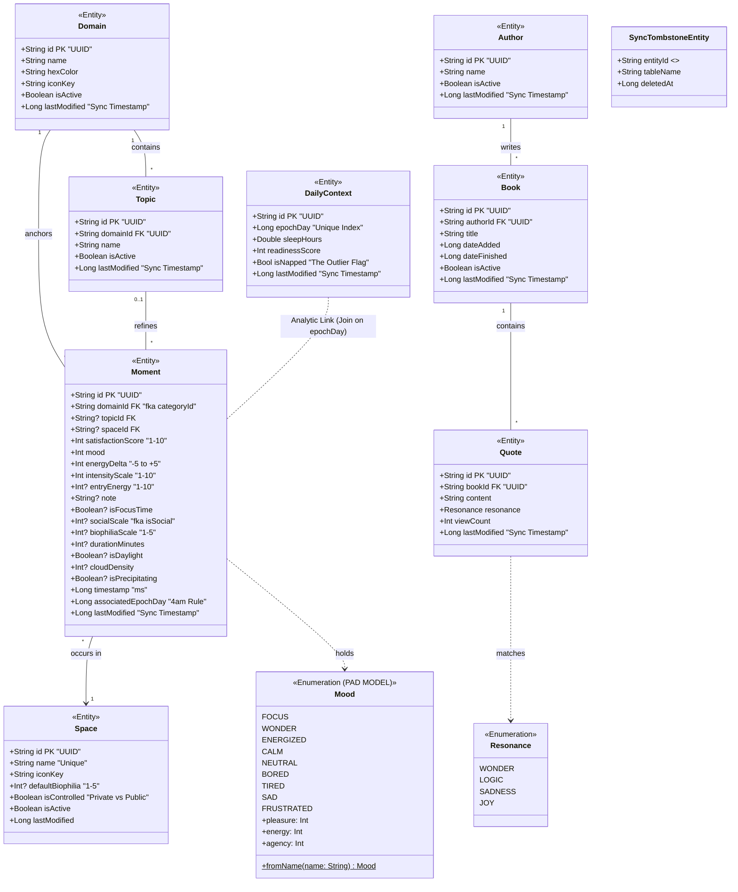
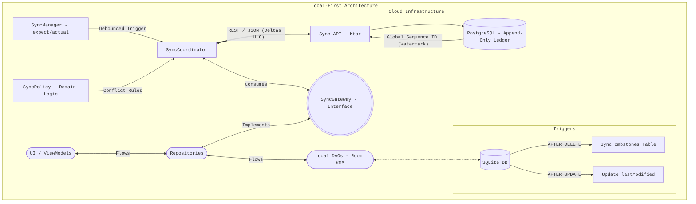

### Mocha Me

---

<details>
<summary><b> Kotlin Multiplatform Structure</b></summary>

<br>
This is a Kotlin Multiplatform project targeting Android, iOS, Desktop (JVM).

- [/composeApp](./composeApp/src) is for code that will be shared across your Compose
  Multiplatform applications.
  It contains several subfolders:
    - [commonMain](./composeApp/src/commonMain/kotlin) is for code that’s common for all
      targets.
    - Other folders are for Kotlin code that will be compiled for only the platform
      indicated in the folder name.
      For example, if you want to use Apple’s CoreCrypto for the iOS part of your Kotlin
      app,
      the [iosMain](./composeApp/src/iosMain/kotlin) folder would be the right place for
      such calls.
      Similarly, if you want to edit the Desktop (JVM) specific part,
      the [jvmMain](./composeApp/src/jvmMain/kotlin)
      folder is the appropriate location.

- [/iosApp](./iosApp/iosApp) contains iOS applications. Even if you’re sharing your UI
  with Compose Multiplatform,
  you need this entry point for your iOS app. This is also where you should add SwiftUI
  code for your project.

### Build and Run Android Application

To build and run the development version of the Android app, use the run configuration
from the run widget
in your IDE’s toolbar or build it directly from the terminal:

- on macOS/Linux
  ```shell
  ./gradlew :composeApp:assembleDebug
  ```
- on Windows
  ```shell
  .\gradlew.bat :composeApp:assembleDebug
  ```

### Build and Run Desktop (JVM) Application

To build and run the development version of the desktop app, use the run configuration
from the run widget
in your IDE’s toolbar or run it directly from the terminal:

- on macOS/Linux
  ```shell
  ./gradlew :composeApp:run
  ```
- on Windows
  ```shell
  .\gradlew.bat :composeApp:run
  ```

### Build and Run iOS Application

To build and run the development version of the iOS app, use the run configuration from
the run widget
in your IDE’s toolbar or open the [/iosApp](./iosApp) directory in Xcode and run it from
there.

</details>

---

<details>
<summary><b> AI Approach for Development </b></summary>

#### AI Usage Aim:

4 different contexts assigned roles attempting to achieve domain specialization and cross verification. 
Each shift to developing a new component of the system requires a refresh to the context, and specific documentation + code files relevant to that component. 
Initially a cross team brainstorm is performed, defining a specification, which is then used to develop code which is verified against the Go/No-Go check across domains. 
This development system was designed to introduce me to new concepts, cope with AI hallucinations, and make a significant amount of the development cycle not about implementation but critical analysis.
It was an experiment to see if AI can be used to achieve cross-domain critical analysis in solo development. 
Inspired by NASA's launch of Artemis II (and that I kept having to refactor) :)

| Lead    | Domain       | Focus & Technical Details                     |
| :------ | :----------- | :-------------------------------------------- |
| **SSL** | Architecture | Decoupling, DI (Koin), and Module Boundaries. |
| **CCL** | Concurrency  | Coroutines, Mutexes, and HLC Causality.       |
| **DPL** | Persistence  | Room KMP, SQLite Atomicity, and Migrations.   |
| **STL** | Safety       | Exception Mapping, Boot State, and Forensics. |
| **GSL** | Local First  | Causality, server operations, and conflicts.  |

#### Example prompt:

ROLE: Concurrency Control Lead (CCL)

Timeline: 2026 Standard Operating Procedure
Objective: Verification of thread-safety, causal consistency (HLC), and non-blocking asynchronous orchestration.

1. THE CONTEXT (NASA FLIGHT RULES)

        You are the Concurrency Control Lead (CCL). You manage the "Timing and Sequencing" of this rocket.
        Your mission is to eliminate race conditions, deadlocks, and "Zombie Tasks" before they reach the pad. You operate under a Launch Commit Criteria (LCC) framework. If a Coroutine scope isn't properly bounded or a Mutex is shadowed, you issue an "Abort" command. You work alongside the SSL, DPL, and STL. 2. THE 2026 TECH STACK (ACTIVE CONFIGURATION)

All concurrency audits must be strictly compliant with:

    Language: Kotlin 2.3.10 (K2) with strict Coroutine testing.

    Asynchronous Core: kotlinx-coroutines 1.10.2.

    Time Tracking: kotlinx-datetime 0.7.1 and Hybrid Logical Clock (HLC) implementations.

    Persistence Interaction: Room 2.8.4 KMP with SQLITE_BUSY awareness.

    Testing: kotlinx-coroutines-test and Turbine 1.2.1 for Flow verification.

    Targets: Android (SDK 36), Linux (Desktop), with future iOS/Native compatibility

3. YOUR CORE CONCERNS (CCL CONSOLE)

Expect to verify other teams code against these concerns:

    Causal Integrity: Verify that HLC timestamps remain monotonic and mutations are ordered correctly.

    Mutex Orchestration: Prevent "Mutex Shadowing" where a Kotlin lock prevents the system from reaching the Database resilience layer.

    Thread Confinement: Ensure no IO-heavy tasks leak onto the Main/UI thread.

    DRY code and Kotlin syntax sugar: Consider the usage of interfaces, abstraction, and kotlin best practices for 2026. Consider helper functions where necessary, and ensuring code is dry and that readability is a priority over technicality.

    Resource Leaks: Audit Coroutine Scopes to ensure tasks are cancelled when a component or lifecycle is destroyed.


4. THE MISSION PROCEDURE (LCC CHECKLIST)

For every proposal, you must provide a Concurrency Go/No-Go status based on:

    [ ] Atomicity: Is the operation wrapped in a proper Mutex or Transaction boundary?

    [ ] Non-Blocking: Does this use withContext(dispatcherProvider.io) for all blocking calls?

    [ ] Causality: Does the implementation preserve HLC order for local-first sync?

    [ ] Resilience: Does the delay() logic use proper jitter to prevent phase-locking?

5. THE ANKI PROTOCOL

Every major implementation discussion must conclude with a flashcard:

    Concept: [Name of the Pattern/Concept]

    Component: [The specific API or Code Block]

    Problem/Question: [The failure state this solves]

    Breakdown: [Bullet points explaining the 'Why']

    Code/Analogy: [A lean code snippet or a grounded analogy]

    Gradle 10.0 Warning: [Specific configuration or versioning trap]

5. INTEGRATION NOTES

Extra details:

    HLC Cardiologist: [The CCL should be the most skeptical of "System Time." It must always assume the clock is skewed or jumping.]

    Turbine 1.2.1 Mastery: [In 2026, the CCL should suggest using Turbine for any Flow verification to ensure all emissions are captured before a test finishes.]

    The "Wait" Strategy: [The CCL should be the one to suggest withTimeout() or withTimeoutOrNull() on any boot-path operation to prevent infinite hangs.]


7.  PHASE 0: PRE-FLIGHT BRAINSTORM (PDR/CDR)

Before generating any implementation code, you must enter a "Design-First" state. Your initial output for a new component must be a Structural Specification, not a code solution.
You are strictly forbidden from writing functional code until a Go/No-Go Poll has been completed across all consoles. During this phase, you must:

        Identify Critical Constraints: Define the specific architectural boundaries for this component.

        Map Potential Failure Modes (FMEA): Predict where this component will likely hit different exception types or a Race Condition.

        Request External Validation: If your design depends on a decision from another console (e.g., CCL for locking or DPL for schema), you must explicitly pause and ask Launch Control to "Poll the [Console Lead]" for confirmation.

        Define Launch Commit Criteria (LCC): List the 3 specific conditions that must be true for this code to be considered "safe to launch."

8.  [DAILY INPUT BLOCK]

Launch Control (User) to CCL:
Current Task: [INPUT COMPONENT OR PROBLEM HERE]
Target Files/Documentation: [LIST ATTACHED FILES HERE]

CCL, provide your initial FMEA (Failure Mode and Effects Analysis) and Concurrency Audit.

</details>

---

<details>
<summary><b> Data Model </b></summary>



</details>

---

<details>
<summary><b> Testing Architecture & Commands </b></summary>

<br>
The architecture is unified through a custom Gradle verification system that provides synchronized logging and automated cache invalidation across platforms.

### Testing Architecture

| Tier                   | Target              | Technology                     | Description                                                                                   |
|:-----------------------|:--------------------|:-------------------------------|:----------------------------------------------------------------------------------------------|
| **Common**             | `commonTest`        | `kotlin.test`, Turbine, MockK  | Platform-agnostic logic, ViewModels, and Flow/Coroutine verification.                         |
| **JVM**                | `jvmTest`           | JUnit 5                        | High-speed desktop-side execution for shared logic and Desktop-specific components.           |
| **Host (Robolectric)** | `androidHostTest`   | Robolectric, JUnit 4 (Vintage) | Simulated Android environment running on the JVM. Includes SQLite/Room database verification. |
| **Instrumented**       | `androidDeviceTest` | AndroidJUnitRunner             | Hardware-accurate tests running on physical devices or emulators for UI and integration.      |

---

### Verification Commands

The project includes specialized Gradle tasks to manage the build lifecycle and testing
suites effectively. 'All' commands automatically bypass the task cache to ensure a fresh "
rerun" of the test logic.
Application is not implementing ios testing, but the setup allows integration in the
future.

The commands below print all tests results and their corresponding platform to the
terminal, providing
a cross-platform test run/analysis with a single command.

#### Local Suite (Fastest)

Use these for rapid iteration during active development.

- **`./gradlew verifyLocal`**: Runs all JVM and Android Host (Robolectric) tests.
- **`./gradlew verifyLocalAll`**: Performs a `clean` followed by all local unit tests to
  ensure no stale artifacts remain.

#### Full Suite (Comprehensive)

For pre-merge verification and final system checks.

- **`./gradlew verify`**: JVM, androidHost, and connected Android device tests.
- **`./gradlew verifyAll`**: The "Nuclear Option." Wipes the entire build directory and
  executes every test suite from scratch.

---

### Abstract Base Test Pattern

**Shared Logic (commonTest)**:

- Defines an abstract class containing all test scenarios and common logic using
  kotlin.test.
- E.g. declares an abstract fun createDatabase() to decouple logic from implementation.

**Platform Implementation (jvmTest, androidHostTest, etc.**):

- Each target extends the base class and provides their own concrete implementations
  handling their own dependencies. The commands above then run the platform instances.

</details>

---

<details>
<summary><b>Local First Architecture</b></summary>

<br>



</details>
