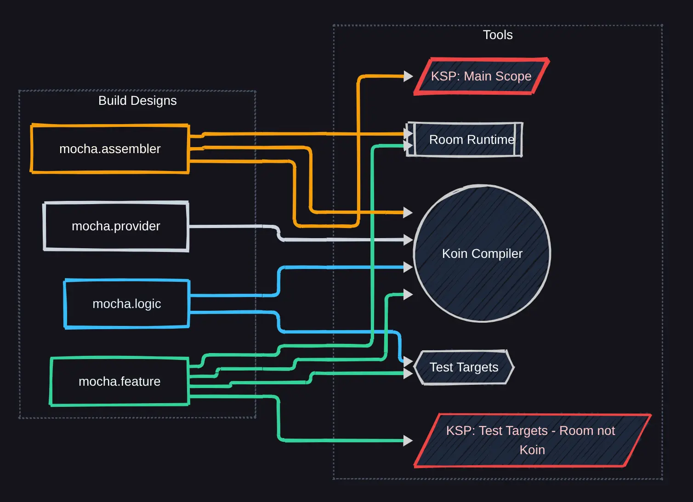
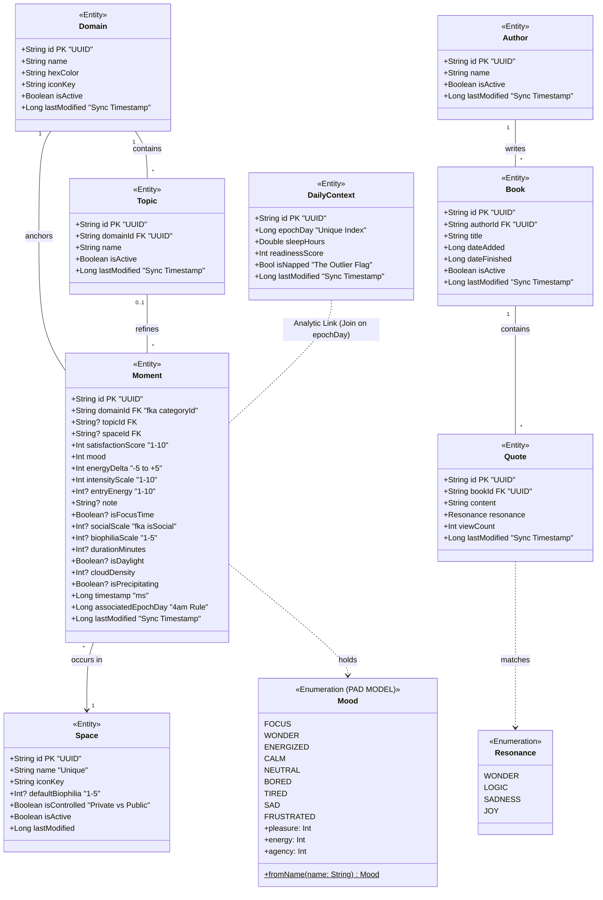

# MochaMe-KMP

This project is a proof-of-concept exploration into Kotlin Multiplatform. The goal is to build an isolated, privacy-centric, local-first sync engine deployable across platforms using minimal platform-specific boilerplate, with the application incorporating swappable edge AI inference. The centerpiece of this architecture is platform testability - utilizing Gradle and Koin.

---

<details>
<summary><b> Local First Architecture </b></summary>

<br>


</details>

---

<details>
<summary><b> Multiplatform Architecture </b></summary>

#### Approach to Development:

```
MochaMe/
├── testing/                          # Provider: Instrumentation
│   └── :mocha-test-support           # Platform-agnostic mocks & DB builders
│
├── core-platform/                    # Provider: Infrastructure
│   └── src/                          # Expect/Actual (Hasher, Identity, POSIX)
│       ├── commonMain/
│       └── [platform]Main/           # jvm, linuxX64, android, ios
│       └── [platform]Test/           # jvm, linuxX64, android, ios

│
├── sync-engine/                      # Layer 0: Sync Engine
│   └── src/
│       ├── commonMain/
│       └── commonTest/
│
├── mocha-feature/                    # Layer 1: Specific Feature (Pure Kotlin)
│   └── :bio / :telemetry / :resonance
│       └── src/
│           ├── commonMain/
│           └── commonTest/           # optimized testing via LinuxX64
│
├── mocha-ui/                         # Layer 2: UI
│   └── src/
│       ├── commonMain/               # ComposeMultiplatform
│       └── [platform]Main/           # Native resources (Insets, Windowing)
│
└── platform-*/                        # Layer 3: Entry Point
    ├── :androidApp/                   # Android APK + @Database
    ├── :desktopAppJVM/                # JVM/Desktop + @Database
    ├── :iosApp/                       # iOS Framework + @Database
    └── :cli-linux/                    # (Headless) Native Binary + @Database
```
<br>

<div align="center">


</div>

</details>

---

<details>
<summary><b> Approach to Gradle Build Design </b></summary>

#### Gradle Build-Logic Configs

##### Core builds to plug in, and what they provide.

###### 1. `mocha.provider` (Lightweight Infrastructure)

**Purpose:** Configures pure structural dependencies and targets for modules that act as APIs or expect/actual providers for simple requirements. Avoids all test runner configuration.

- **Targets Declared:** `jvm()`, `linuxX64()`, `android()`, iOS.
- **Source Sets Declared:** None explicitly.
- **Test Runners:** None.
- **Koin Compiler:** Applied.
- **Room Scope:** None.

###### 2. `mocha.logic` (Pure Logic)

**Purpose:** Configures the standard execution environment for pure Kotlin modules that do not define persistence schemas. Essentially just tools.

- **Targets Declared:** `jvm()`, `linuxX64()`, `android()`, iOS.
- **Source Sets Declared:** `androidHostTest`, `androidDeviceTest`, `jvmTest`
- **Test Runners:** Standard test runners (`androidHostTest`, `jvmTest`, `linuxX64Test`, iOS) injected - _unit tests_.
- **Koin Compiler:** Applied.
- **Room Scope:** None.

###### 3. `mocha.feature` (Heavy Components)

**Purpose:** Designed exclusively for features that require isolated micro-schemas for testing their integration logic across platforms.

- **Targets Declared:** `jvm()`, `linuxX64()`, `android()`, iOS.
- **Source Sets Declared:** `commonMain`: Injects `implementation(libs.room.runtime)` to allow `@Dao` and `@Entity` compilation.
- **Test Runners:** Standard test runners (`androidHostTest`, `jvmTest`, `linuxX64Test`, iOS) injected.
- **Koin Compiler:** Applied.
- **Room Scope:** Runtime: Provided to `commonMain`.
- **KSP (Compiler):** Applied strictly to test configurations (e.g., `kspAndroidHostTest`, `kspJvmTest`) using target iteration. Keep main compilation free of generation overhead - no `@Database` in main, purely in test.

###### 4. `mocha.assembler` (Aggregator)

**Purpose:** Configures the final assembly points where domain DAOs are aggregated into production code.

- **Targets Declared:** `jvm()`, `linuxX64()`, `android()`, iOS.
- **Source Sets Declared:** `commonMain`: Injects `implementation(libs.room.runtime)`.
- **Test Runners:** Fully configured.
- **Koin Compiler:** Applied.
- **Room Scope:** Runtime: Provided to `commonMain`.
- **KSP (Compiler):** Applied to standard main configurations (e.g., `kspAndroid`, `kspJvm`). Expect `@Database` in main.

<br>



</details>

---

<details>
<summary><b> AI Approach for Development </b></summary>

#### AI Usage Aim:

Different contexts assigned roles attempting to achieve domain specialization and cross verification. 
Each shift to developing a new component of the system requires a refresh to the context, and specific documentation + code files relevant to that component. 
Initially a cross team brainstorm is performed, defining a specification, which is then used to develop code which is verified against the Go/No-Go check across domains. 
This development system was designed to introduce me to new concepts, cope with AI hallucinations, and make a significant amount of the development cycle not about implementation but critical analysis.
It was an experiment to see if AI can be used to achieve cross-domain critical analysis in solo development. 
Inspired by NASA's launch of Artemis II (and that I kept having to refactor) :)

| Lead    | Domain       | Focus & Technical Details                     |
| :------ | :----------- | :-------------------------------------------- |
| **SSL** | Architecture | Decoupling, DI (Koin), and Module Boundaries. |
| **CCL** | Concurrency  | Coroutines, Mutexes, and HLC Causality.       |
| **DPL** | Persistence  | Room KMP, SQLite Atomicity, and Migrations.   |
| **STL** | Safety       | Exception Mapping, Boot State, and Forensics. |
| **GSL** | Local First  | Causality, server operations, and conflicts.  |


#### Anki Integration

Every major implementation discussion must conclude with a flashcard:

    Concept: [Name of the Pattern/Concept]

    Component: [The specific API or Code Block]

    Problem/Question: [The failure state this solves]

    Breakdown: [Bullet points explaining the 'Why']

    Code/Analogy: [A lean code snippet or a grounded analogy]

    Gradle 10.0 Warning: [Specific configuration or versioning trap]


</details>

---

<details>
<summary><b> Data Model </b></summary>

<br>

At its core, sleep context wraps each day, and the non-nullable fields of any moment:

```
        +Int satisfactionScore "1-10"
        +Int mood
        +Int energyDelta "-5 to +5"
        +Int intensityScale "1-10"
```
Weather/meta context to be handled in the background. A moment must be linked to a general domain (e.g. Kotlin or Exercise), with the topic being optional (e.g. concurrency or swimming). I hope this to be enough to generate useful analytics (mapping mood to a simple PAD model for the current scope) whilst requiring minimal input. 
Social, environmental (made easier by the ability to save a space and its biophilia), journalling, duration, and entry energy, are all optional and serve only to enrich the analysis if the user wants.

The Book logging and notes is primarily something I need, but may be useful in providing an obvious indication as to whether the AI can actually match a specific state to valid areas of knowledge that the user has previously recorded.

What it crucially lacks:
- things I haven't thought of
- nutritional information
- biological context
- influence of music

The model below is constantly changing, and now includes atomic HLCs all over. 


</details>

---

<details>
<summary><b> Testing Architecture & Commands </b></summary>

<br>
The architecture is unified through a custom Gradle verification system that provides synchronized logging and automated cache invalidation across platforms.

### Testing Architecture

| Tier                   | Target              | Technology                     | Description                                                                                   |
|:-----------------------|:--------------------|:-------------------------------|:----------------------------------------------------------------------------------------------|
| **Common**             | `commonTest`        | `kotlin.test`, Turbine, MockK  | Platform-agnostic logic, ViewModels, and Flow/Coroutine verification.                         |
| **JVM**                | `jvmTest`           | JUnit 5                        | High-speed desktop-side execution for shared logic and Desktop-specific components.           |
| **Host (Robolectric)** | `androidHostTest`   | Robolectric, JUnit 4 (Vintage) | Simulated Android environment running on the JVM. Includes SQLite/Room database verification. |
| **Instrumented**       | `androidDeviceTest` | AndroidJUnitRunner             | Hardware-accurate tests running on physical devices or emulators for UI and integration.      |

---

### Verification Commands

The project includes specialized Gradle tasks to manage the build lifecycle and testing
suites effectively. 'All' commands automatically bypass the task cache to ensure a fresh "
rerun" of the test logic.
Application is not implementing ios testing, but the setup allows integration in the
future.

The commands below print all tests results and their corresponding platform to the
terminal, providing
a cross-platform test run/analysis with a single command.

#### Local Suite (Fastest)

Use these for rapid iteration during active development.

- **`./gradlew verifyLocal`**: Runs all JVM and Android Host (Robolectric) tests.
- **`./gradlew verifyLocalAll`**: Performs a `clean` followed by all local unit tests to
  ensure no stale artifacts remain.

#### Full Suite (Comprehensive)

For pre-merge verification and final system checks.

- **`./gradlew verify`**: JVM, androidHost, and connected Android device tests.
- **`./gradlew verifyAll`**: The "Nuclear Option." Wipes the entire build directory and
  executes every test suite from scratch.

---

### Abstract Base Test Pattern

**Shared Logic (commonTest)**:

- Defines an abstract class containing all test scenarios and common logic using
  kotlin.test.
- E.g. declares an abstract fun createDatabase() to decouple logic from implementation.

**Platform Implementation (jvmTest, androidHostTest, etc.**):

- Each target extends the base class and provides their own concrete implementations
  handling their own dependencies. The commands above then run the platform instances.

</details>

---
