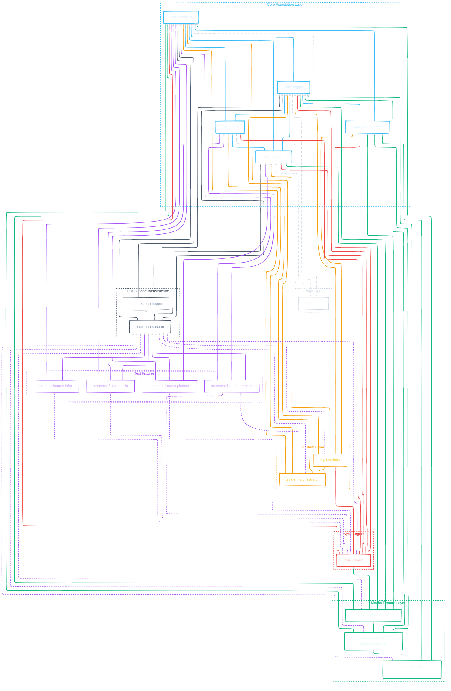

# MochaMe Module Dependency Flow Analysis

This document provides a comprehensive map of the inter-project dependency flows among the modules of **MochaMe**. It details how dependencies are set up, highlights central dependency injection from `:build-logic`, maps reachability, and visualizes the architecture using a Mermaid diagram.

---

## 1. Executive Summary & Design Insights

* **Isolated Core Contracts**: The `:core:contract` module is completely isolated, having no dependencies on any other module in the project. Per the central build configuration, almost all modules depend on it via an `api` (transitive) dependency.
* **Decoupled Sync Engine**: The `:sync-engine` does **not** rely on any `:mocha` feature modules, remaining a self-contained system. It depends only on `:core` and `:system` modules.
* **Sequential Feature Cascade**: The `:mocha:mocha-feature` modules are structured in a strict sequential chain:
  $$\text{:mocha:mocha-feature:resonance} \longrightarrow \text{:mocha:mocha-feature:telemetry} \longrightarrow \text{:mocha:mocha-feature:bio} \longrightarrow \text{:sync-engine} / \text{:core:platform} / \text{:core:contract}$$
* **Standalone Build Logic**: The `:build-logic` project is an *included build* (`includeBuild`) that contains shared convention plugins. It defines the targets, test runners, and standard dependencies (like injecting `:core:contract` and `:core:logger` automatically).
* **Ignored Modules** (per instructions): `:app` (and its submodules), `:mocha:mocha-ui`, and `:mocha:mocha-schema`.

---

## 2. Centralized Dependency Injection (`:build-logic`)

Shared dependencies are governed by the custom convention plugins inside `build-logic`. Specifically, [TargetConfig.kt](file:///home/oscarmichael/AndroidStudioProjects/MochaMe/build-logic/src/main/kotlin/com/mochame/gradle/TargetConfig.kt#L89-L108) and [TestConfig.kt](file:///home/oscarmichael/AndroidStudioProjects/MochaMe/build-logic/src/main/kotlin/com/mochame/gradle/TestConfig.kt#L10-L28) define standard dependencies that are applied transitively based on the convention plugin used:

### A. Main Dependencies Injection (`applyStandardDependencies`)
Applied to all modules using `mocha.convention.provider`, `mocha.convention.logic`, or `mocha.convention.feature`:
1. **Core Contract**: Every module except `:core:contract` itself gets `api(project(":core:contract"))`. This exposes the contracts transitively to any downstream consumer.
2. **Core Logger**: Every module except `:core:contract` and `:core:logger` gets `implementation(project(":core:logger"))`. This is an internal dependency.
3. **Test Support (for Fixtures)**: Any test fixtures module (name starting with `:core:test:fixtures-`) gets `api(project(":core:test:support"))`.

### B. Test Dependencies Injection (`configureTestTargets`)
Applied to all modules with test builders enabled (modules using `mocha.convention.logic` or `mocha.convention.feature`):
1. **Common Test Support**: In `commonTest`, these modules automatically receive `implementation(project(":core:test:support"))`.

---

<details>
<summary><b> Module Dependency Table </b></summary>

<br>

This table summarizes direct project-level dependencies for all analyzed modules.

| Module Path | Applied Convention Plugin | Direct Main Dependencies (API) | Direct Main Dependencies (Implementation) | Direct Test Dependencies (`commonTest` / `jvmTest`) | Downstream Dependents (What depends on this module) |
| :--- | :--- | :--- | :--- | :--- | :--- |
| **`:core:contract`** | `mocha.convention.provider` | None | None | None | **All modules** (except itself) |
| **`:core:logger`** | `mocha.convention.provider` | `:core:contract` *(implicit)* | None | None | **All modules** (except `:core:contract` & itself) |
| **`:core:sync-contract`** | `mocha.convention.provider` | `:core:contract` *(implicit)* | `:core:logger` *(implicit)* | None | `:system:infra`, `:sync-engine`, `:mocha:mocha-feature:bio` (and downstream features) |
| **`:core:utils`** | `mocha.convention.logic` | `:core:contract` *(implicit)* | `:core:logger` *(implicit)* | `:core:test:support` *(implicit)* | `:core:platform`, `:system:orchestrator`, `:sync-engine`, `:core:test:fixtures-contract`, `:core:test:fixtures-utils` |
| **`:core:platform`** | `mocha.convention.logic` | `:core:contract` *(implicit)* | `:core:utils`, `:core:logger` *(implicit)* | `:core:test:support` *(implicit)* | `:core:test:support`, `:sync-engine`, `:mocha:mocha-feature:bio`, `:core:test:fixtures-platform`, `:system:infra` *(test)* |
| **`:core:test:test-logger`** | `mocha.convention.provider` | `:core:contract` *(implicit)*, `:core:logger` | None | None | `:core:test:support` |
| **`:core:test:support`** | `mocha.convention.provider` | `:core:contract` *(implicit)*, `:core:test:test-logger` | `:core:platform`, `:core:logger` *(implicit)* | None | All fixtures (Main API); All logic/feature modules (Test) |
| **`:core:test:fixtures-contract`** | `mocha.convention.provider` | `:core:contract`, `:core:test:support` *(implicit)* | `:core:utils`, `:core:logger` *(implicit)* | None | `:system:orchestrator` *(test)*, `:sync-engine` *(test)* |
| **`:core:test:fixtures-system-infra`** | `mocha.convention.provider` | `:core:contract` *(implicit)*, `:core:test:support` *(implicit)* | `:core:logger` *(implicit)* | None | `:sync-engine` *(test)* |
| **`:core:test:fixtures-utils`** | `mocha.convention.provider` | `:core:utils`, `:core:contract` *(implicit)*, `:core:test:support` *(implicit)* | `:core:logger` *(implicit)* | None | `:sync-engine` *(test)* |
| **`:core:test:fixtures-platform`** | `mocha.convention.provider` | `:core:platform`, `:core:contract` *(implicit)*, `:core:test:support` *(implicit)* | `:core:logger` *(implicit)* | None | `:sync-engine` *(test)* |
| **`:system:infra`** | `mocha.convention.feature` | `:core:contract` *(implicit)* | `:core:sync-contract` *(implicit)*, `:core:logger` *(implicit)* | `:core:platform`, `:core:test:support` *(implicit)* | `:system:orchestrator`, `:sync-engine` |
| **`:system:orchestrator`** | `mocha.convention.logic` | `:core:contract` *(implicit)* | `:core:utils`, `:system:infra`, `:core:logger` *(implicit)* | `:core:test:fixtures-contract`, `:core:test:support` *(implicit)* | None *(except ignored app modules)* |
| **`:sync-engine`** | `mocha.convention.feature` | `:core:contract` *(implicit)* | `:core:platform`, `:core:utils`, `:system:infra`, `:core:sync-contract` *(implicit)*, `:core:logger` *(implicit)* | `:core:test:fixtures-contract`, `:core:test:fixtures-system-infra`, `:core:test:fixtures-utils`, `:core:test:fixtures-platform`, `:core:test:support` *(implicit)* | `:mocha:mocha-feature:bio` |
| **`:mocha:mocha-feature:bio`** | `mocha.convention.feature` | `:core:contract` *(implicit)* | `:core:contract`, `:sync-engine`, `:core:platform`, `:core:sync-contract` *(implicit)*, `:core:logger` *(implicit)* | `:core:test:support` *(implicit)* | `:mocha:mocha-feature:telemetry` |
| **`:mocha:mocha-feature:telemetry`** | `mocha.convention.feature` | `:core:contract` *(implicit)* | `:mocha:mocha-feature:bio`, `:core:sync-contract` *(implicit)*, `:core:logger` *(implicit)* | `:core:test:support` *(implicit)* | `:mocha:mocha-feature:resonance` |
| **`:mocha:mocha-feature:resonance`** | `mocha.convention.feature` | `:core:contract` *(implicit)* | `:mocha:mocha-feature:telemetry`, `:core:sync-contract` *(implicit)*, `:core:logger` *(implicit)* | `:core:test:support` *(implicit)* | None *(except ignored app modules)* |

> [!NOTE]
> Implicit dependencies are injected by the convention plugins inside `:build-logic`. Transitive `api` dependencies from a library are automatically exposed to any module that depends on it.

</details>

---

<details>
<summary><b> Reachability and Navigation </b></summary>

<br>

This map defines what modules you can reach (import classes from) depending on where you are situated in the codebase, and what modules can transitively reach you.

```
[Module Name]
├── CAN REACH (Inside the module, what is compile-visible to you)
│   ├── Main: Direct & transitive API dependencies
│   └── Test: Additional test-scope dependencies
└── CAN BE REACHED BY (Downstream consumers)
    ├── Main: Modules that depend on you
    └── Test: Modules that depend on you for tests
```

### :core:contract
* **CAN REACH**:
  * Main: *None (Isolated)*
  * Test: *None*
* **CAN BE REACHED BY**:
  * Main: Every single module in the codebase (via standard build logic injection).

### :core:logger
* **CAN REACH**:
  * Main: `:core:contract`
* **CAN BE REACHED BY**:
  * Main: Every single module except `:core:contract` (via standard build logic injection).

### :core:sync-contract
* **CAN REACH**:
  * Main: `:core:contract` (via direct `api` dependency, exposed transitively) and `:core:logger` (via direct `implementation` dependency, internal-only).
* **CAN BE REACHED BY**:
  * Main: `:system:infra`, `:sync-engine`, `:mocha:mocha-feature:bio`, `:mocha:mocha-feature:telemetry`, `:mocha:mocha-feature:resonance`.

### :core:utils
* **CAN REACH**:
  * Main: `:core:contract`, `:core:logger` *(internal)*
  * Test: `:core:test:support` *(internal)*
* **CAN BE REACHED BY**:
  * Main: `:core:platform`, `:system:orchestrator`, `:sync-engine`
  * Test: `:core:test:fixtures-contract`, `:core:test:fixtures-utils`

### :core:platform
* **CAN REACH**:
  * Main: `:core:utils` *(internal)*, `:core:contract`, `:core:logger` *(internal)*
  * Test: `:core:test:support` *(internal)*
* **CAN BE REACHED BY**:
  * Main: `:core:test:support`, `:sync-engine`, `:mocha:mocha-feature:bio`
  * Test: `:system:infra` *(test)*, `:core:test:fixtures-platform` *(test fixture)*

### :core:test:test-logger
* **CAN REACH**:
  * Main: `:core:logger`, `:core:contract`
* **CAN BE REACHED BY**:
  * Main: `:core:test:support` (transitive to all fixtures)

### :core:test:support
* **CAN REACH**:
  * Main: `:core:platform` *(internal)*, `:core:test:test-logger`, `:core:contract`, `:core:logger` *(internal)*
* **CAN BE REACHED BY**:
  * Main: `:core:test:fixtures-contract`, `:core:test:fixtures-system-infra`, `:core:test:fixtures-utils`, `:core:test:fixtures-platform`
  * Test: `:core:utils`, `:core:platform`, `:system:infra`, `:system:orchestrator`, `:sync-engine`, `:mocha:mocha-feature:bio`, `:mocha:mocha-feature:telemetry`, `:mocha:mocha-feature:resonance`

### :core:test:fixtures-contract
* **CAN REACH**:
  * Main: `:core:contract`, `:core:test:support`, `:core:utils` *(internal)*, `:core:logger` *(internal)*, `:core:test:test-logger` *(transitive)*
* **CAN BE REACHED BY**:
  * Test: `:system:orchestrator` *(test)*, `:sync-engine` *(test)*

### :core:test:fixtures-system-infra
* **CAN REACH**:
  * Main: `:core:contract`, `:core:test:support`, `:core:logger` *(internal)*, `:core:test:test-logger` *(transitive)*
* **CAN BE REACHED BY**:
  * Test: `:sync-engine` *(test)*

### :core:test:fixtures-utils
* **CAN REACH**:
  * Main: `:core:utils`, `:core:contract`, `:core:test:support`, `:core:logger` *(internal)*, `:core:test:test-logger` *(transitive)*
* **CAN BE REACHED BY**:
  * Test: `:sync-engine` *(test)*

### :core:test:fixtures-platform
* **CAN REACH**:
  * Main: `:core:platform`, `:core:contract`, `:core:test:support`, `:core:logger` *(internal)*, `:core:test:test-logger` *(transitive)*
* **CAN BE REACHED BY**:
  * Test: `:sync-engine` *(test)*

### :system:infra
* **CAN REACH**:
  * Main: `:core:contract`, `:core:sync-contract` *(internal)*, `:core:logger` *(internal)*
  * Test: `:core:platform` *(internal)*, `:core:test:support` *(internal)*
* **CAN BE REACHED BY**:
  * Main: `:system:orchestrator`, `:sync-engine`

### :system:orchestrator
* **CAN REACH**:
  * Main: `:core:utils` *(internal)*, `:system:infra` *(internal)*, `:core:contract`, `:core:logger` *(internal)*
  * Test: `:core:test:fixtures-contract` *(internal)*, `:core:test:support` *(internal)*
* **CAN BE REACHED BY**:
  * None *(top-level system component)*

### :sync-engine
* **CAN REACH**:
  * Main: `:core:platform` *(internal)*, `:core:utils` *(internal)*, `:system:infra` *(internal)*, `:core:contract`, `:core:logger` *(internal)*, `:core:sync-contract` *(internal)*
  * Test: `:core:test:fixtures-contract` *(internal)*, `:core:test:fixtures-system-infra` *(internal)*, `:core:test:fixtures-utils` *(internal)*, `:core:test:fixtures-platform` *(internal)*, `:core:test:support` *(internal)*
* **CAN BE REACHED BY**:
  * Main: `:mocha:mocha-feature:bio`

### :mocha:mocha-feature:bio
* **CAN REACH**:
  * Main: `:sync-engine` *(internal)*, `:core:platform` *(internal)*, `:core:contract`, `:core:logger` *(internal)*, `:core:sync-contract` *(internal)*
  * Test: `:core:test:support` *(internal)*
* **CAN BE REACHED BY**:
  * Main: `:mocha:mocha-feature:telemetry`

### :mocha:mocha-feature:telemetry
* **CAN REACH**:
  * Main: `:mocha:mocha-feature:bio` *(internal)*, `:core:contract`, `:core:logger` *(internal)*, `:core:sync-contract` *(internal)*, `:sync-engine` *(transitive)*, `:core:platform` *(transitive)*
  * Test: `:core:test:support` *(internal)*
* **CAN BE REACHED BY**:
  * Main: `:mocha:mocha-feature:resonance`

### :mocha:mocha-feature:resonance
* **CAN REACH**:
  * Main: `:mocha:mocha-feature:telemetry` *(internal)*, `:core:contract`, `:core:logger` *(internal)*, `:core:sync-contract` *(internal)*, `:mocha:mocha-feature:bio` *(transitive)*, `:sync-engine` *(transitive)*, `:core:platform` *(transitive)*
  * Test: `:core:test:support` *(internal)*
* **CAN BE REACHED BY**:
  * None *(top-level feature component)*

</details>

---

<details>
<summary><b> Visual Flowchart (Mermaid) </b></summary>

<br>


<br>

### Mermaid Code:



</details>


---
*Generated by Antigravity on 2026-06-15.*
