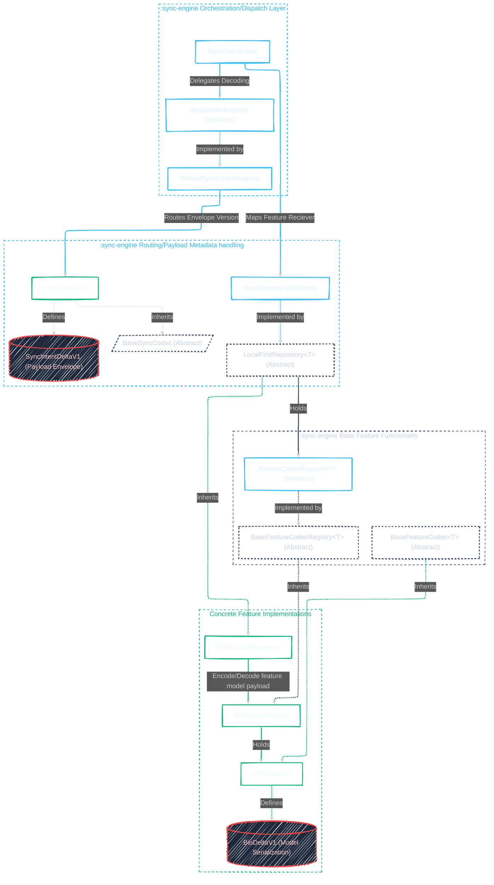

## Visual

 

## Breakdown

### Inbound Pipeline (Ingestion)

1. **Network Entry**
    * **Data State:** `ByteArray` (Raw ingress stream).
    * **Receiver:** `SyncCoordinator` [Module: `:sync-engine`].

2. **System Demux & Parsing**
    * **Action:** `SyncCoordinator` delegates to `DefaultSyncCodecRegistry` [Module: `:sync-engine`].
    * **Action:** Routed to `SyncCodecV1` (implements `BaseSyncCodec`) [Module: `:sync-engine`].
    * **Model Transition:** Unpacks `ByteArray` into `SyncIntentDeltaV1` (Internal Data Class) $\rightarrow$ materializes engine domain model `SyncIntent`.

3. **Routing & Dispatch**
    * **Action:** `SyncCoordinator` queries its `receiverRoutingTable: Map<String, SyncReceiver>`.
    * **Model Transition:** Generates a `DecodeContext` (Combines engine sync metadata with target `LocalFirstEntity<T>` requirements).
    * **Action:** Invokes `SyncReceiver.processRemoteIntent(metadata, payload, blobId)`.

4. **Feature Materialization**
    * **Receiver:** `LocalFirstRepository<T>` (implements `SyncReceiver`) [Module: `:sync-engine`].
    * **Action:** Automatically hooks into implementation `DefaultBioRepository` [Module: `:mocha:feature-...`].
    * **Action:** `DefaultBioRepository` passes `DecodeContext` and payload to its feature codec registry.

5. **Schema Deserialization**
    * **Receiver:** `BioCodecRegistry` (extends `BaseFeatureCodecRegistry<T>`) [Module: `:mocha:feature-...`].
    * **Action:** Routes payload to `BioCodecV1` (extends `BaseFeatureCodec`) [Module: `:mocha:feature-...`].
    * **Model Transition:** Deserializes binary packet into `BioDeltaV1` (Internal Feature Delta Class) $\rightarrow$ converts to final concrete domain model `T` (`DailyContext`).
    * **Execution:** `DefaultBioRepository` writes `DailyContext` into local SQLite storage.

---

### Outbound Pipeline (Mutation)

1. **UI Intent Capture**
    * **Origin:** `Feature ViewModel` [Module: `:mocha:feature-...`].
    * **Model State:** UI Event / Mutation Action.
    * **Action:** Dispatched to `DefaultBioRepository`.

2. **Local Repository Interception**
    * **Receiver:** `DefaultBioRepository` (extends `LocalFirstRepository<T>`) [Module: `:mocha:feature-...`].
    * **Action:** Intercepts event inside `processIntent` and branches to a local-first mutation strategy.

3. **Feature Delta Generation**
    * **Action:** Passes mutation to `BioCodecRegistry` $\rightarrow$ delegates to `BioCodecV1`.
    * **Model Transition:** Serializes the state event using the newest schema version into a `BioDeltaV1` data structure.

4. **Outbox Persistence Boundary**
    * **Model Transition:** Wraps `BioDeltaV1` binary payload into a system-level `SyncIntentEntity` database row.
    * **Execution:** Persists row directly to the local Outbox table database. **[Pipeline Decoupling Point]**

5. **Engine Sweep & Extraction**
    * **Trigger:** `SyncCoordinator` [Module: `:sync-engine`] observes the outbox database table.
    * **Action:** On notification of a new row, `SyncCoordinator` extracts the record.
    * **Model Transition:** Converts `SyncIntentEntity` row back into engine domain model `SyncIntent`.

6. **System Packaging & Transmission**
    * **Action:** Passes `SyncIntent` down to `DefaultSyncCodecRegistry` $\rightarrow$ delegates to `SyncCodecV1`.
    * **Model Transition:** `SyncCodecV1` serializes the metadata envelope + feature payload block into an atomic `SyncIntentDeltaV1`.
    * **Final Data State:** Compressed outbound `ByteArray` handed over to the network client for transport.

 

## Component Dependencies by Module

### Module: `:sync-engine`

* **`SyncCoordinator` (Class)**
    * *Dependencies:* `SyncReceiver`, `SyncIntentStore`, `SyncModuleStateStore`, `SyncCodecRegistry`
* **`SyncCodecRegistry` (Interface)**
    * *Dependencies:* None
* **`DefaultSyncCodecRegistry` (Class)**
    * *Dependencies:* `SyncCodecRegistry` (Implements), `SyncCodecV1`
* **`BaseSyncCodec` (Abstract Class)**
    * *Dependencies:* None
* **`SyncReceiver` (Interface)**
    * *Dependencies:* `EntityMetadata`
* **`LocalFirstRepository<T: LocalFirstEntity<T>>` (Abstract Class)**
    * *Dependencies:* `SyncReceiver` (Implements), `FeatureCodecRegistry<T>`
* **`FeatureCodecRegistry<T: LocalFirstEntity<T>>` (Interface)**
    * *Dependencies:* `LocalFirstEntity`
* **`BaseFeatureCodecRegistry<T: LocalFirstEntity<T>>` (Abstract Class)**
    * *Dependencies:* `FeatureCodecRegistry<T>` (Implements)
* **`BaseFeatureCodec<T: LocalFirstEntity<T>>` (Abstract Class)**
    * *Dependencies:* `BufferProvider`, `Logger`

### Module: `:core:contract` (or platform equivalent)

* **`SyncIntent` (Domain Model)**
    * *Dependencies:* None
* **`DecodeContext` (Domain Model)**
    * *Dependencies:* `LocalFirstEntity`
* **`LocalFirstEntity<T>` (Interface)**
    * *Dependencies:* None

### Module: `:mocha:feature-...` (e.g., `:mocha:feature-bio`)

* **`BioCodecRegistry` (Class)**
    * *Dependencies:* `BaseFeatureCodecRegistry<T>` (Extends), `BioCodecV1`
* **`BioCodecV1` (Class)**
    * *Dependencies:* `BaseFeatureCodec<T>` (Extends), `BioDeltaV1` (Internal Data Model)
* **`DefaultBioRepository` (Class)**
    * *Dependencies:* `LocalFirstRepository<T>` (Extends), `BioCodecRegistry`
