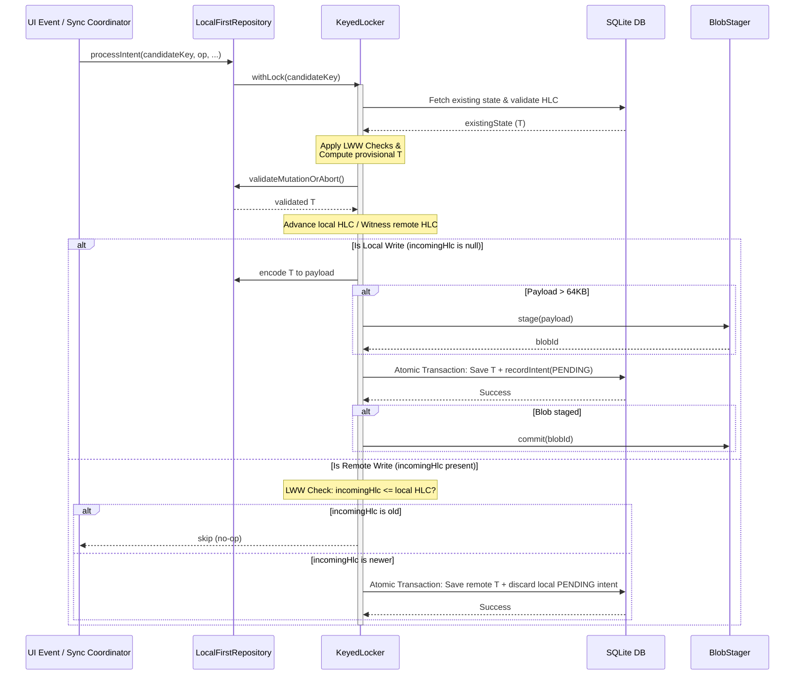

# SyncStatus Architecture & Synchronization Lifecycle Audit

This document presents a comprehensive audit of the `SyncStatus` component and its integration with `SyncModuleStateEntity` and `SyncIntentEntity` in a local-first distributed architecture utilizing Hybrid Logical Clocks (HLC) and Last-Write-Wins (LWW) resolution.

---

## 1. Executive Summary & Design Goals

The MochaMe Sync Engine is designed to support a **local-first distributed architecture**. It operates on the following core principles:
* **Immediate Local Commits**: Local writes are committed immediately to the database alongside a staged synchronization intent, ensuring zero latency for the user.
* **Asynchronous Sync Pipelines**: Uploading local changes and downloading remote changes are executed in background threads, governed by state-based lifecycle status gates.
* **Deterministic Conflict Resolution**: Utilizes **Hybrid Logical Clocks (HLC)** and **Last-Write-Wins (LWW)** lexicographical sorting to ensure all nodes converge on the exact same state without needing a central coordinator.
* **Lease-Based Concurrency Control**: Uses unique session lease tokens (`syncId`) to prevent duplicate synchronization loops or zombie threads from committing stale states.

The [SyncStatus](file:///home/oscarmichael/AndroidStudioProjects/MochaMe/sync-engine/src/commonMain/kotlin/com/mochame/sync/domain/state/SyncStatus.kt) enum is the central state machine driver, operating at two distinct levels:
1. **Ledger Level (`SyncIntentEntity`)**: Tracking the outbox lifecycle of a single mutation record.
2. **Metadata Level (`SyncModuleStateEntity`)**: Tracking the lifecycle and locking status of an entire syncable domain module (e.g., `BIO`, `RESONANCE`).

---

## 2. SyncStatus Dual-Role Definition

The [SyncStatus](file:///home/oscarmichael/AndroidStudioProjects/MochaMe/sync-engine/src/commonMain/kotlin/com/mochame/sync/domain/state/SyncStatus.kt) enum defines the following states:

```kotlin
enum class SyncStatus(val id: Int) {
    IDLE(0),     // Metadata: Everything in sync. No active tasks.
    PENDING(1),  // Ledger: Waiting in outbox. Metadata: Idle, waiting for sync.
    SYNCING(2),  // Ledger: Uploading. Metadata: Active sync session (Master Lock held).
    SUCCESS(3),  // Ledger: ACKed by server. Metadata: Last session was successful.
    FAILED(4);   // Metadata Only: Last session failed or crashed.
}
```

### Contextual Matrix: Ledger vs. Metadata Level

| State | Role in [SyncIntentEntity](file:///home/oscarmichael/AndroidStudioProjects/MochaMe/sync-engine/src/commonMain/kotlin/com/mochame/sync/data/entities/SyncEntities.kt#L42-L56) (Ledger Outbox) | Role in [SyncModuleStateEntity](file:///home/oscarmichael/AndroidStudioProjects/MochaMe/sync-engine/src/commonMain/kotlin/com/mochame/sync/data/entities/SyncEntities.kt#L16-L25) (Module Metadata) |
| :--- | :--- | :--- |
| **`IDLE`** | *Not Used.* | Clean state. No local modifications are pending, and no sync sessions are active. |
| **`PENDING`** | The mutation is waiting in the outbox to be shipped. | The module has unsynced local mutations or is waiting to retry a previous sync. |
| **`SYNCING`** | The intent has been claimed by a session and is currently uploading. | A sync session has acquired the master lock and is executing upload/download flows. |
| **`SUCCESS`** | The server has ACKed the mutation. It acts as a tombstone or history record. | The last sync session was a success; the server watermark is up to date. |
| **`FAILED`** | *Not Used.* | The last sync session crashed or failed. The lock is released, and a retry is needed. |

---

## 3. Local-First Mutative Flow & LWW Resolution



### Local Mutation Staging (Outbound Pipeline)
When a local write is triggered via [LocalFirstRepository.processIntent](file:///home/oscarmichael/AndroidStudioProjects/MochaMe/sync-engine/src/commonMain/kotlin/com/mochame/sync/infrastructure/LocalFirstRepository.kt#L70), the engine steps through:
1. **Serialization Locking**: A key-specific lock is obtained using [KeyedLocker](file:///home/oscarmichael/AndroidStudioProjects/MochaMe/sync-engine/src/commonMain/kotlin/com/mochame/sync/infrastructure/KeyedLocker.kt) to prevent race conditions.
2. **HLC Stamping**: A monotonic HLC is requested via [HlcFactory](file:///home/oscarmichael/AndroidStudioProjects/MochaMe/sync-engine/src/commonMain/kotlin/com/mochame/sync/contract/HlcFactory.kt).
3. **Payload Encoding & Stage Forking**:
   * If the payload is **$\le$ 64KB**, it is stored inline in the DB transaction.
   * If the payload is **> 64KB**, it is offloaded to the filesystem via [BlobStager](file:///home/oscarmichael/AndroidStudioProjects/MochaMe/sync-engine/src/commonMain/kotlin/com/mochame/sync/domain/stores/BlobStager.kt) and linked in the database via `overflowBlobId`.
4. **Atomic Write**: In a single transaction:
   * The new entity state is saved.
   * A [SyncIntentEntity](file:///home/oscarmichael/AndroidStudioProjects/MochaMe/sync-engine/src/commonMain/kotlin/com/mochame/sync/data/entities/SyncEntities.kt#L42) is recorded in the outbox as `SyncStatus.PENDING`.
   * The [SyncModuleStateEntity](file:///home/oscarmichael/AndroidStudioProjects/MochaMe/sync-engine/src/commonMain/kotlin/com/mochame/sync/data/entities/SyncEntities.kt#L16) is updated via [recordLocalMutation](file:///home/oscarmichael/AndroidStudioProjects/MochaMe/sync-engine/src/commonMain/kotlin/com/mochame/sync/data/daos/SyncModuleStateDao.kt#L128) to state `SyncStatus.PENDING`.

### Conflict Resolution & LWW Causality
Conflict resolution happens on remote inbound writes inside [processRemoteIntent](file:///home/oscarmichael/AndroidStudioProjects/MochaMe/sync-engine/src/commonMain/kotlin/com/mochame/sync/infrastructure/LocalFirstRepository.kt#L133). HLC objects are compared lexicographically: **physical wall-clock time (`ts`) $\to$ logical counter (`count`) $\to$ unique nodeId**.

The conflict decision matrix handles incoming intents as follows:
* **LWW Rejection**: If `incomingHlc <= existingState.hlc`, the incoming remote change is stale. The repository ignores it and terminates (`onSkip`).
* **LWW Acceptance**: If `incomingHlc > existingState.hlc`, the incoming remote change is newer.
  * The local clock witnesses the remote HLC (`hlcFactory.witness(incomingHlc)`) to ensure local monotonicity.
  * The remote entity is persisted.
  * **Remote Override Compaction**: Any existing `PENDING` outbox intent for this record key is deleted from the outbox (`syncIntentStore.discardIntent`) as it is now obsolete.

---

## 4. Network Boundaries: What Crosses the Wire?

To minimize data transmission and maintain absolute privacy boundaries, the network payload and the local persistence models are strictly decoupled.

> [!NOTE]
> Database locks, retry limits, and sync lifecycle statuses do not cross the wire. They are device-centric state variables.

```
       +---------------------------------------------+
       |             SyncIntentEntity                |
       |  (hlc, candidateKey, module, model, op,     |
       |   payload, overflowBlobId)                  |
       +---------------------------------------------+
                              |
                     [ SyncCodecV1.kt ] (Protobuf Serialization)
                              |
                              v
       +---------------------------------------------+
       |             SyncIntentDeltaV1               |  <--- SHIPPED ON NETWORK
       |  (hlc, candidateKey, module, model, op,     |
       |   payloadBlob, overflowBlobId)              |
       +---------------------------------------------+
```

### Network Bound Comparison

| Field Name | Present in DB | Shipped on Wire? | Rationale |
| :--- | :--- | :--- | :--- |
| **`hlc`** | Yes | **Yes** | Required for Last-Write-Wins (LWW) comparison on receiving nodes. |
| **`candidateKey`** | Yes | **Yes** | Identifies the unique target record. |
| **`module` / `model`** | Yes | **Yes** | Directs routing to the correct feature repository/receiver. |
| **`operation`** | Yes | **Yes** | Specifies DML operation (`INSERT`, `UPDATE`, `DELETE`). |
| **`payload` / `overflowBlobId`** | Yes | **Yes** | Transmits raw payload or offloaded blob hash. |
| **`syncStatus`** | Yes | **No** | Local outbox gatekeeper; decoded remote intents are initialized to `PENDING` locally. |
| **`syncId`** | Yes | **No** | Master lock token; private lease identifying the active device session. |
| **`hasConflict`** | Yes | **No** | Local diagnostic flag. |
| **`retryCount`** | Yes | **No** | Local failure backoff count. |
| **`createdAt`** | Yes | **No** | Device wall-clock timestamp; HLC is used for remote ordering. |

---

## 5. Locking, Concurrency, & Recovery Lifecycle

Synchronization safety is maintained through a combination of pessimistic database-level locks, session lease validations, and startup reconciliation routines.

### A. The Master Lock Lifecycle
1. **Lock Acquisition (`claimSyncLock`)**:
   * Scoped at the module level.
   * A session claims the lock by transition: `IDLE / PENDING` $\to$ `SYNCING` while writing its unique session identifier (`syncId`).
   * SQLite transactions ensure mutual exclusion: if two workers attempt this concurrently, only one will succeed (returning 1 row affected).
2. **Lock Release (`releaseLock`)**:
   * In case of failures, the lock is cleared by setting `syncId = NULL` and status = `FAILED` or `PENDING`.
   * **Zombie Safety**: The query checks `WHERE syncId = :staleSyncId`. This prevents a timed-out, late-running thread from releasing a lock that has already been reassigned to a new sync session.
3. **Sync Finalization (`finalizeSyncSuccess`)**:
   * Transitions status `SYNCING` $\to$ `SUCCESS`, clears `syncId = NULL`, and stamps the server watermark.

### B. Startup Recovery Protocol (`SyncJanitor`)
Upon application boot, [SyncJanitor](file:///home/oscarmichael/AndroidStudioProjects/MochaMe/sync-engine/src/commonMain/kotlin/com/mochame/sync/orchestration/SyncJanitor.kt) executes a self-healing protocol:
1. **Wiping Stale Mutation Locks**: Finds all intents in `SyncIntentEntity` that have a non-null `syncId` (meaning they were mid-sync when the app crashed) and resets them back to `PENDING` with a null `syncId`.
2. **Resetting Dirty Modules**: Runs `moduleStore.bulkResetDirtyModules()` to identify modules in `SYNCING` or intermediate states and resets them to `PENDING` while clearing the `syncId`.
   * **Zombie Safety**: If a crashed thread returns to life, any finalize or success query it tries to commit will fail since its cached `syncId` will no longer match the database (which was updated to `NULL` by the Janitor).
3. **HLC Clock Hydration**: Queries the maximum ledger logical clock (`getLedgerGlobalMaxHlc()`) to hydrate the local `HlcFactory`, preventing clock regression on boot.
4. **Blob Reconciliation**: Resolves mismatch states between staged filesystem blobs and database records:
   * Files in `/pending` that have a matching database intent hash are **Committed** (moved to `/committed`).
   * Files in `/pending` without a database record (due to transaction rollback before crash) are **Aborted** (purged).

---

## 6. Batching System Analysis

To synchronize data efficiently, the database schema supports batching via `claimBatch` and `getClaimedBatch` in [SyncIntentDao](file:///home/oscarmichael/AndroidStudioProjects/MochaMe/sync-engine/src/commonMain/kotlin/com/mochame/sync/data/daos/SyncIntentDao.kt#L52-L78):

```kotlin
@Query(
    """
    UPDATE SyncIntentEntity 
    SET syncId = :sessionId, syncStatus = :syncingStatus
    WHERE hlc IN (
        SELECT hlc FROM SyncIntentEntity
        WHERE syncId IS NULL 
        AND module = :entityType 
        AND syncStatus = :pendingStatus
        LIMIT :limit
    )
"""
)
suspend fun claimBatch(...)
```

### Is the Batch System Optimal?
1. **Design Strengths**: 
   * Transitioning a batch to `SYNCING` under a `syncId` acts as a row-level write lock. This is highly optimal as it allows concurrent sync loops to run for different modules without interfering with one another.
2. **Implementation Gap**:
   * Although the database layer supports batching, the current orchestrator implementation ([SyncCoordinator.kt](file:///home/oscarmichael/AndroidStudioProjects/MochaMe/sync-engine/src/commonMain/kotlin/com/mochame/sync/orchestration/SyncCoordinator.kt#L46-L62)) does not utilize it. It retrieves *all* pending intents for a module using `intentStore.getPendingByModule(module)`, meaning batch limitations are currently bypassed in the runtime application layer.

---

## 7. Critical Code Audits & Defects

During our sweeping audit, we discovered two severe defects in the database query layer that will impact causal ordering and disable ledger cleanup.

### Defect 1: Lack of Causal Ordering in `claimBatch`
* **File**: [SyncIntentDao.kt](file:///home/oscarmichael/AndroidStudioProjects/MochaMe/sync-engine/src/commonMain/kotlin/com/mochame/sync/data/daos/SyncIntentDao.kt#L52-L73)
* **The Issue**: The subquery inside `claimBatch` selects keys up to a limit but lacks an `ORDER BY` clause. HLC-based syncing demands that mutations are processed in strict chronological order to preserve causality. Without sorting, SQLite might return records in physical database insertion order or arbitrary index order, causing dependent updates to sync before their parent inserts.
* **Impact**: Potential LWW rejection or transient foreign key constraints violations on the server.
* **Recommended Fix**: Add an `ORDER BY hlc ASC` clause to the subquery:
  ```sql
  SELECT hlc FROM SyncIntentEntity
  WHERE syncId IS NULL 
    AND module = :entityType 
    AND syncStatus = :pendingStatus
  ORDER BY hlc ASC
  LIMIT :limit
  ```
  Additionally, index this query using a composite index on `(module, syncStatus, hlc)` for optimal index lookup.

### Defect 2: Broken Pruning in `pruneOldSynced` (Critical Bug)
* **File**: [SyncIntentDao.kt](file:///home/oscarmichael/AndroidStudioProjects/MochaMe/sync-engine/src/commonMain/kotlin/com/mochame/sync/data/daos/SyncIntentDao.kt#L101-L117)
* **The Issue**: The query to delete old records matches by `syncId`:
  ```sql
  DELETE FROM SyncIntentEntity 
      WHERE syncId IN (
          SELECT syncId FROM SyncIntentEntity
          WHERE syncStatus = :status 
          AND createdAt < :cutoff
          LIMIT :limit
      )
  ```
  However, upon successful sync, the engine calls `markAsSynced()` which sets `syncStatus = SUCCESS` and sets `syncId = NULL`. Because synced records have a `NULL` syncId, the subquery returns `[NULL]`. The outer query evaluates to `WHERE syncId IN (NULL)`, which returns `UNKNOWN` in SQL.
* **Impact**: **No records are ever pruned**. The database will grow boundlessly over time, resulting in significant storage overhead and degraded query performance.
* **Recommended Fix**: Rewrite the query to match and delete using the primary key `hlc`:
  ```sql
  DELETE FROM SyncIntentEntity 
  WHERE hlc IN (
      SELECT hlc FROM SyncIntentEntity
      WHERE syncStatus = :status 
        AND createdAt < :cutoff
      LIMIT :limit
  )
  ```

---

## 8. Failure Pathway & Design Gaps Audit (`SyncStatus.FAILED`)

This section documents the cross-domain audit of synchronization failure pathways, focusing on the current gaps surrounding the `SyncStatus.FAILED` state, concurrency race conditions, and architecture recommendations.

### A. Gaps in the Current Codebase
* **Unused State**: While the `SyncStatus.FAILED` enum exists, and `DefaultSyncModuleStateStore` provides an unimplemented `updateSyncingToFailure` method, **`SyncStatus.FAILED` is never actually transitioned to or utilized** anywhere in the active orchestrator (`SyncCoordinator.kt`) or repository layers.
* **Lack of Error Metadata**: `SyncModuleStateEntity` contains no fields to track error codes, error messages, or failure timestamps. The failure state is represented only by a status code, leaving the system diagnostic-blind.

---

### B. Ownership of the `FAILED` Transition: Coordinator vs. Repository

> [!IMPORTANT]
> **Architectural Recommendation**: The transition of a module state to `SyncStatus.FAILED` must be owned by the **SyncCoordinator** (or orchestration layer), not the local repositories.

#### Rationale:
1. **Lifecycle Scope**: The repository only executes local DML operations and has no visibility into the network sync session, timeout intervals, socket health, or HTTP status codes.
2. **Lease Validation**: Changing a module status to `FAILED` requires resetting its active lock lease (`syncId = NULL`). Only the coordinator holds the unique session token required to release the database lock safely without introducing race conditions from late-running threads.

---

### C. Gaps in Local Write Staging on a `FAILED` Module

When a local write is performed, the repository calls `recordLocalMutation` which unconditionally updates the module's status back to `SyncStatus.PENDING`:

```kotlin
// SyncModuleStateDao.kt
@Query("""
    UPDATE SyncModuleStateEntity 
    SET moduleMaxHlc = :hlc, 
        lastLocalMutationTime = :now ,
        syncStatus = :syncStatus
    WHERE module = :module
""")
suspend fun recordLocalMutation(...)
```

#### Technical Gaps & Risks:
1. **Buried Diagnostics**: If a module is currently marked as `FAILED` (due to an error), making a new local write immediately overwrites the state to `PENDING`, permanently erasing any record of the failure at the module metadata level.
2. **Poison Pill Compaction**: If an intent fails sync due to a persistent business validation error on the server, writing another update to that same record will trigger compaction and discard the previous failing intent's `hlc` and payload. This risks losing diagnostic trace summaries or silently burying unresolvable data validation issues.
3. **Queue Stalling vs. Offline availability**:
   * **The Offline-First Principle**: We **must** allow local writes even if a module is in a `FAILED` state. Local availability should never be blocked by network synchronization failures.
   * **The Recommendation**: Separate **Sync Queue Status** (whether unsynced data exists) from **Sync Session Health** (error logs, backoffs). We should enhance `SyncModuleStateEntity` to store error metadata columns (e.g., `consecutiveFailureCount`, `lastSyncErrorMessage`) that persist even when `syncStatus` transitions back to `PENDING` due to a new local write.

---

### D. The `claimSyncLock` Block Defect (Deadlock on Failure)

The `claimSyncLock` method in [SyncModuleStateDao.kt](file:///home/oscarmichael/AndroidStudioProjects/MochaMe/sync-engine/src/commonMain/kotlin/com/mochame/sync/data/daos/SyncModuleStateDao.kt#L69-L76) restricts lock claiming:

```kotlin
    @Query("""
        UPDATE SyncModuleStateEntity 
        SET syncId = :newSyncId, syncStatus = :syncingStatus
        WHERE module = :module 
        AND (syncStatus = :idleStatus OR syncStatus = :pendingStatus)
    """)
    suspend fun claimSyncLock(...)
```

#### The Gap:
* Because this query only matches when `syncStatus` is `IDLE` (0) or `PENDING` (1), **a module in the `FAILED` (4) state can never be locked for synchronization again**.
* Any subsequent sync sessions triggered by background timers or network connection events will fail to acquire the lock and abort immediately.
* The module is stuck in `FAILED` until either a user makes a new local edit (advancing status to `PENDING`) or the app restarts (triggering a startup reset sweep).

#### Recommended Fix:
1. **Allow Direct Claims**: Update `claimSyncLock` to allow claiming directly from `FAILED`:
   ```sql
   WHERE module = :module 
   AND (syncStatus = :idleStatus OR syncStatus = :pendingStatus OR syncStatus = :failedStatus)
   ```
2. **Scheduler Recovery**: The coordinator should integrate with platform schedulers (like WorkManager) to automatically queue a retry that transitions the module from `FAILED` to `PENDING` after an exponential backoff delay.

---

### E. Concurrency Race Conditions & State Parity

There is a critical race condition in the parity transitions between individual intents and parent module states under concurrent execution.

#### 1. The Stranded Pending Write Race
If a sync session is running (`SYNCING`, `syncId = "session-1"`), and a concurrent local write occurs:
1. The repository writes a new `PENDING` intent.
2. The repository calls `recordLocalMutation` to update the module state to `PENDING` (but the `syncId` remains `"session-1"`).
3. The sync session completes successfully and calls `finalizeSyncSuccess(module, "session-1", watermark)`.
4. **The Bug**: `finalizeSyncSuccess` updates the module's `syncStatus` to `SUCCESS` / `IDLE` and resets `syncId = NULL`. It completely overwrites the `PENDING` status written in step 2.
5. **The Outcome**: The new local mutation's intent is left stranded in the database as `PENDING`, but the module is marked as `SUCCESS`. The sync engine will not trigger a sync for it, leaving the user's data unsynced indefinitely.

#### 2. Remote Inbound State Pollution
In `LocalFirstRepository.handleRemoteCommit()` (handling incoming sync packets), the engine calls `updateModuleMetadata(hlc)`, which sets the local module status to `PENDING`.
* **The Bug**: This marks the module as dirty with outbound changes even though it only processed a remote inbound write, leading to redundant upload sync loops.

#### Recommended Architecture Fixes for Concurrency:
* **Conditional Finalization**: Modify `finalizeSyncSuccess` to verify if there are any remaining `PENDING` intents (specifically those with a null `syncId`) before transitioning the module to `SUCCESS`. If outstanding pending intents exist, the module status must remain `PENDING`.
* **Isolate Inbound updates**: Create a dedicated `updateMaxHlcFloor` method that only advances the local HLC max floor and `lastServerSyncTime` during inbound remote commits, without mutating the module's `syncStatus` or `syncId`.
* **Transactional Parity**: Wrap intent creation, module lock claims, compaction, and finalization sweeps inside strict serializable database transactions to prevent race conditions.

---

### F. Orchestration & Batch Recovery Gaps

1. **Over-Aggressive Startup Reset**:
   * Currently, `SyncJanitor` resets *all* non-`IDLE` modules to `PENDING` on startup via `bulkResetDirtyModules()`.
   * **The Gap**: This incorrectly regresses modules that successfully completed sync (`SUCCESS`) back to `PENDING`, forcing the bootloader to run redundant outbox checks. It should only target `SYNCING` and `FAILED` modules.
2. **Poison Pill Blocking (All-or-Nothing Reversion)**:
   * If a batch containing 50 intents has one intent that persistently fails due to server validation logic, the engine currently rolls back the entire batch to `PENDING`. This stalls synchronization for all 49 valid intents.
   * **The Recommendation**: Transition to a **non-atomic selective finalization** protocol. The coordinator should evaluate individual intent outcomes: transition successful intents to `SUCCESS`, transient failures back to `PENDING` (incrementing `retryCount`), and persistent failures directly to `SyncIntent.syncStatus = FAILED` to quarantine them and allow subsequent batches to proceed.
3. **Dead Pruning Code**:
   * `SyncJanitor.pruneInChunks()` is defined but never called, meaning synced intents are never pruned, causing query degradation over time. It must be hooked up to run during startup checks or weekly background sweeps.

---

## 9. Proposal for Distributed Sync & Causality Redesign

To establish causal consistency, poison-pill recovery, and thread-safe lock state transitions, we propose a complete model and ingestion pathway redesign.

### A. Model Redesign Kotlin Schemas

#### 1. SyncModuleStateEntity
```kotlin
package com.mochame.sync.data.entities

import androidx.room.Entity
import androidx.room.PrimaryKey
import com.mochame.contract.metadata.MochaModule
import com.mochame.sync.domain.state.SyncStatus

/**
 * Persists the synchronization status, watermarks, and health diagnostics
 * for an entire sync module.
 */
@Entity
data class SyncModuleStateEntity(
    @PrimaryKey
    val module: MochaModule,
    
    // Core Watermarks and HLCs
    val serverWatermark: String? = null,
    val moduleMaxHlc: String? = null,
    val syncId: String? = null,
    val syncStatus: SyncStatus = SyncStatus.IDLE,
    val lastServerSyncTime: Long = 0L,
    val lastLocalMutationTime: Long = 0L,

    // Error Tracking
    val consecutiveFailures: Int = 0,
    val lastErrorMessage: String? = null,
    val lastErrorCode: String? = null,
    val lastErrorTimestamp: Long = 0L,

    // Quarantining at Module level (e.g., due to auth failure)
    val isQuarantined: Boolean = false,
    val quarantinedAt: Long? = null,
    val quarantineReason: String? = null
)
```

#### 2. SyncIntentEntity
```kotlin
package com.mochame.sync.data.entities

import androidx.room.Entity
import androidx.room.Index
import androidx.room.PrimaryKey
import com.mochame.contract.metadata.MochaModule
import com.mochame.contract.metadata.MutationOp
import com.mochame.sync.domain.state.SyncStatus
import kotlin.time.Clock

/**
 * Local mutation staging outbox record with error diagnostics,
 * poison-pill quarantining, and causal dependency tracking.
 */
@Entity(
    indices = [
        Index(value = ["syncStatus"]),
        Index(value = ["candidateKey", "module", "syncStatus"]),
        Index(value = ["syncStatus", "createdAt"]),
        Index(value = ["module", "syncStatus"]),
        Index(value = ["syncId"]),
        Index(value = ["isQuarantined"])
    ]
)
data class SyncIntentEntity(
    @PrimaryKey 
    val hlc: String,
    val candidateKey: String,
    val module: MochaModule,
    val model: String,
    val operation: MutationOp,
    val syncStatus: SyncStatus,
    val syncId: String? = null,
    
    // Payload Details
    val payload: ByteArray?,
    val diagnosticSummary: String?,
    val overflowBlobId: String?,
    
    // Conflict and Retry Tracking
    val hasConflict: Boolean = false,
    val retryCount: Int = 0,
    val createdAt: Long = Clock.System.now().toEpochMilliseconds(),

    // Schema Validation
    val schemaVersion: Int = 1,

    // Error Tracking & Poison-Pill Quarantine
    val consecutiveFailures: Int = 0,
    val lastErrorMessage: String? = null,
    val lastErrorCode: String? = null,
    val lastErrorTimestamp: Long = 0L,
    val isQuarantined: Boolean = false,
    val isPersistentFailure: Boolean = false,
    val quarantinedAt: Long? = null,
    val quarantineReason: String? = null,

    // Causality and Chained Ordering
    val parentHlc: String? = null,          // Preceding HLC for same key
    val dependentHlcs: String? = null       // Comma-separated dependencies (cross-key)
)
```

#### 3. DecodeContext
```kotlin
package com.mochame.sync.domain.model

import com.mochame.contract.metadata.MutationOp
import com.mochame.sync.contract.HLC

/**
 * Metadata delivered with remote changes to run schema compatibility checks,
 * identify mutation origins, and direct conflict resolution.
 */
data class DecodeContext(
    val id: String,
    val hlc: HLC,
    val op: MutationOp,
    val lastModified: Long,

    // Schema versioning
    val schemaVersion: Int = 1,
    val minCompatibleSchemaVersion: Int = 1,

    // Conflict resolution & tracking rules
    val originNodeId: String,
    val resolutionStrategy: String? = "LWW", // E.g., LWW, MERGE_JSON, SERVER_WINS
    val clientVersion: String? = null,        // Originating app version
    val vectorClock: Map<String, Long>? = null // Multi-node logical timestamps
)
```

---

### B. Device & Module States Proposed Definitions

1.  **`IDLE`**: Module is fully synchronized. No local modifications (`PENDING` intents) exist. The lock `syncId` is `NULL`.
2.  **`PENDING`**: Module is dirty. Unsynced intents are staged in the outbox. The lock `syncId` is `NULL`, indicating to the scheduler that it is eligible to sync.
3.  **`SYNCING`**: Active upload/download in progress. The coordinator holds the master lock (`syncId` is set to session token).
4.  **`FAILED_TRANSIENT`**: Sync failed due to recoverable errors (e.g. timeout, 503). The lock is released (`syncId = NULL`), and the module reverts to `PENDING` with an exponential retry schedule.
5.  **`FAILED_PERSISTENT`**: Sync failed due to unrecoverable errors (e.g. poison pill, bad schema). The module status is marked `FAILED` (or `IDLE` with a quarantined outbox item), recording logs in the metadata fields, and subsequent intents are allowed to proceed.
6.  **`RECONCILING`**: Startup sweep state. Interrupted sync sessions (marked `SYNCING`) are reset, stranded filesystem blobs are cleaned up, and HLC clocks are hydrated before any sync sessions start.

---

### C. Step-by-Step Execution Pathways

#### 1. Inbound Ingestion Pathway (Remote $\to$ Local)
*   **Step 1: Network Ingest**: `SyncCoordinator.onInboundBytes` decodes raw bytes into a `SyncIntent` model.
*   **Step 2: Compatibility Check**: Verify `schemaVersion >= localVersion`. If incompatible, abort and quarantine the incoming intent.
*   **Step 3: Routing**: Resolve the `SyncReceiver` based on model string.
*   **Step 4: Lock Acquisition**: Call `locker.withLock(candidateKey)` to lock writes for this key.
*   **Step 5: LWW Conflict Check**: Fetch the existing database entity. Compare: `incomingHlc <= existingState.hlc`.
    *   *If True*: Remote update is stale. Abort and skip write.
    *   *If False*: Proceed to write.
*   **Step 6: Clock Advancement**: Witness the clock: `hlcFactory.witness(incomingHlc)`.
*   **Step 7: Compaction Override**: Discard any existing `PENDING` outbox intent matching the `candidateKey` in `SyncIntentEntity` (as the remote edit supersedes local edits).
*   **Step 8: Persistence**: Write the concrete entity `T` to its table.
*   **Step 9: HLC Floor Advancement**: Call a specialized `updateHlcFloor` on `SyncModuleStateDao` to update `moduleMaxHlc` and `lastServerSyncTime` without setting `syncStatus` to `PENDING`.
*   **Step 10: Unlock**: Release key lock.

#### 2. Outbound Ingestion Pathway (Local $\to$ Remote)
*   **Step 1: Module Locking**: Claim module sync lock via `claimSyncLock(module, sessionUuid)`. It succeeds if the module status is in `IDLE`, `PENDING`, or `FAILED`.
*   **Step 2: Batch Claiming**: Lock a batch of up to 50 intents using `claimBatch(sessionUuid, module, limit)`. This selects intents in order of `hlc ASC` (preserving causality) and updates their status to `SYNCING` and `syncId = sessionUuid`.
*   **Step 3: Packaging & Offloading**: Serialize intents to `SyncIntentDeltaV1`. For inline payloads, send immediately. For filesystem-staged blobs (>64KB), fetch bytes via the stager.
*   **Step 4: Network push**: Send the batch to the gateway.
*   **Step 5: Non-Atomic Selective Finalization**:
    *   *Successes*: Call `markAsSynced(hlcs, SUCCESS)` to set status to `SUCCESS` and clear `syncId`.
    *   *Transient Failures*: Revert status to `PENDING`, clear `syncId`, increment `retryCount`.
    *   *Persistent Failures*: Transition intent status to `FAILED` (quarantined), clear `syncId`, write error logs to `lastErrorMessage` on the intent.
*   **Step 6: Parity-Aware Lock Release**: Query the database to see if any `PENDING` intents remain (specifically those with `syncId IS NULL` created concurrently during transmission).
    *   *If pending exists*: Transition module status to `PENDING` and set `syncId = NULL`.
    *   *If no pending remains*: Transition module status to `SUCCESS` / `IDLE` and set `syncId = NULL`.

---

## 10. Step-by-Step Implementation Action Plan

### Target A: DAO Layer Modifications
1.  **Modify `SyncIntentDao.claimBatch`**:
    *   Add `ORDER BY hlc ASC` to the batch subquery.
    *   Allow batch claims from both `PENDING` and `FAILED` status codes.
2.  **Modify `SyncModuleStateDao.claimSyncLock`**:
    *   Allow lock acquisition from `IDLE`, `PENDING`, and `FAILED` states.
3.  **Refactor `bulkResetDirtyModules` and `getDirtyModuleNames`**:
    *   Change queries to only target and reset `SYNCING` and `FAILED` status codes, leaving `SUCCESS` and `IDLE` modules untouched.
4.  **Add `updateHlcFloor` to `SyncModuleStateDao`**:
    *   Create a transaction method that updates `moduleMaxHlc` and `lastServerSyncTime` without modifying `syncStatus` or `syncId`.

### Target B: Local Repository Layer Modifications
1.  **Refactor `LocalFirstRepository.handleRemoteCommit`**:
    *   Replace the `updateModuleMetadata` call with `syncModuleStateStore.updateHlcFloor(module, hlc)` to prevent remote inbound changes from dirtying the local outbox status.
2.  **Implement Compaction Staging Aborts**:
    *   In `recordIntent`, when discard is called on a compacted intent, check if it contains a `overflowBlobId`. If present, invoke `blobStore.abort(blobId)` immediately to clean up files under `/pending`.
3.  **Add Validation Hook**:
    *   Expose `open fun validateEntity(entity: T): Boolean = true` in `LocalFirstRepository` and execute it in `processIntent` prior to database commit.

### Target C: Orchestration & Scheduler Modifications
1.  **Implement `SyncCoordinator` Outbound Loop**:
    *   Implement the `syncModule(module)` method utilizing a `while` loop that requests batches of 50 via `claimBatch`, pushes them, and processes individual successes and failures.
2.  **Implement Selective Finalization**:
    *   Map server responses back to HLCs, and execute selective Room updates to set successes to `SUCCESS`, transients to `PENDING` (with retry increments), and poison pills to `FAILED`.
3.  **Create `BackgroundSyncScheduler` & WorkManager Integration**:
    *   Add the `androidx.work:work-runtime-ktx` dependency to `build.gradle.kts`.
    *   Define the `BackgroundSyncScheduler` abstraction in the common code.
    *   Implement the Android WorkManager scheduler that schedules retries using exponential backoff criteria and network connection constraints.
4.  **Wire Up Pruning**:
    *   In `SyncJanitor.startupChecks()`, launch `pruneInChunks()` on the `appScope` (using `ioContext`) after completing hydration and blob sweeps to avoid blocking the main startup thread.
